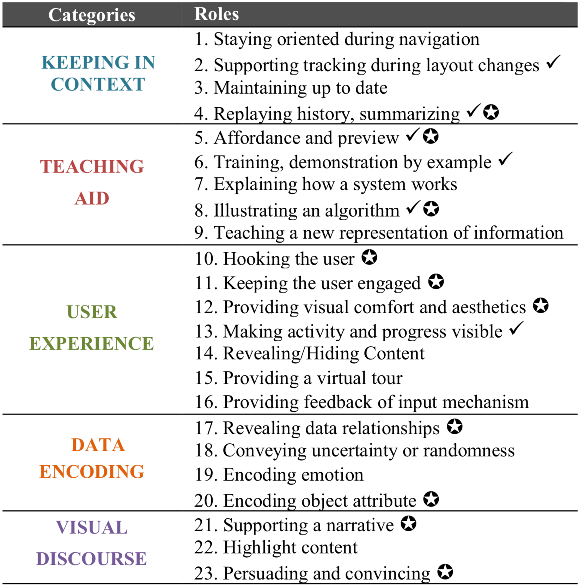

&nbsp;

Smooth animated transitions, where a graphic display changes continuously in time, are increasingly common in modern graphical interfaces. They are more appealing than still images, feel more realistic, and usually improve the aesthetics of user interfaces. Beyond their compelling nature, animations are powerful tools that can be used for various purposes. 

Despite their popularity, animations are still largely under-comprehended as a cognitive aid tool. What makes a good, effective animation that improves the usability of graphical interfaces remains unclear. These works aim to increase our understanding of animation in user interface, its roles, benefits and limitations.

&nbsp;

## Animation 25 Years Later : new roles and opportunities

A thorough exploration of the roles animation play in interactive interfaces, 25 years after Baecker's seminal work [_animation at the interface_](http://ron.taglab.ca/papers/B3.pdf).

&nbsp;

#### Reference
Fanny Chevalier, Nathalie Henry Riche, Catherine Plaisant, Amira Chalbi, Christophe Hurter  
[__Animation 25 Years Later: New Roles and Opportunities__](http://www.cs.toronto.edu/~fchevali/fannydotnet//resources_pub/pdf/animation25yearslater.pdf)  
International Conference on Advanced Visual Interfaces (AVI '16). 2016. pp 280-287.  

&nbsp;

#### Companion website
Check out our [companion website](http://animations.recherche.enac.fr/) with all roles and many examples.

&nbsp;

&nbsp;

## The Not-so-staggering Effect of Staggered Animation

An evaluation of the impact of staggered animation on multiple object tracking

&nbsp;

#### Reference
Fanny Chevalier, Pierre Dragicevic, Steven Franconeri  
[__The Not-so-staggering Effect of Staggered Animation__](http://www.cs.toronto.edu/~fchevali/fannydotnet//resources_pub/pdf/notsostaggering-infovis14.pdf)  
IEEE Transactions on Visualization and Computer Graphics (TVCG / Proc. of Infovis '14),  20(12):2241-2250. 2014.  

&nbsp;

#### Companion website
Check out our [companion website](http://fannychevalier.net/animations/staggered-animations/index.html) with all of the material to replicate our experiments, including instructions for participants, experimental program, logs and analysis scripts.

<iframe width="300" height="245" src="https://www.youtube.com/embed/2MfWF6sLzpo" frameborder="0" allowfullscreen></iframe>

